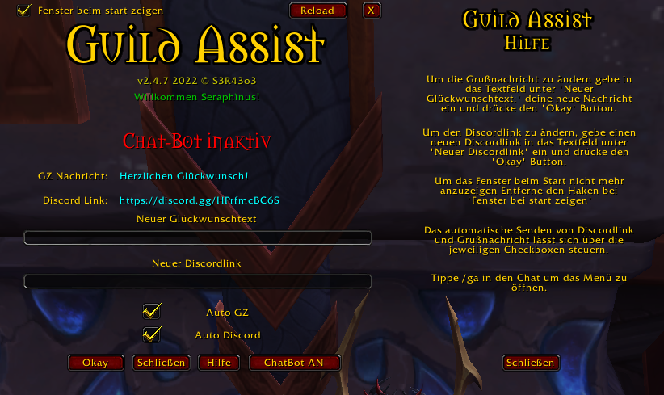

# GUILDASSIST WoW AddOn #

> A simple little addon to send automated guild chat messages when a guild member gets an achievement. You can choose between your own created message or predefined ASCII images.
> Also save Discord/Teamspeak invitation links and send them to the guild chat via chat command "!discord" if activated.
> The whole Project is now on Version 3.X. I refactor much like everything.
>
> - New graphical UserInterface
> - Remove .XML Files
> - Translate to english
> - Add ACii Images as premade GZ-Message to choose

## Features ##

> - allows you to use the keyboard arrow keys to scroll through your sent message history.
> - Set the time in seconds between achieving the achievement and sending the congratulation message.
> - minimap icon to show/hide addon menu
> - Slashcommand "/ga" - Shows the AddOn Menu
> - Slashcommand "/fs" - short command for buildin "/framestack".
> - Slashcommand "/rl" - short command for buildin "/reload
> - Slashcommand "/gahelp" - shows the AddOn Help

## Installation ##

>**This Addon is only tested on the latest world of warcraft retail version 9.2.7!**
>You can simple download and install this AddOn on [Curse Forge](https://www.curseforge.com/wow/addons/guildassist3)!
>If you facing any problems please open a new Issue.
>Just unzip the ZIP-File into your World of Warcraft Addons directory.

## Preview ##

## Changelog ##

v3.3.5 (no Release):

> - add new Frame for mythic + Routes
> - add basic constructor for fontstrings & buttons
> - add scrollframe and scrollframe behaivour

v3.3.4:

> - add 'how to' to helpframe
> - change color from helpframe title
> - Update version
> - refactoring code
> - add config.lua
> - rename close-help button
