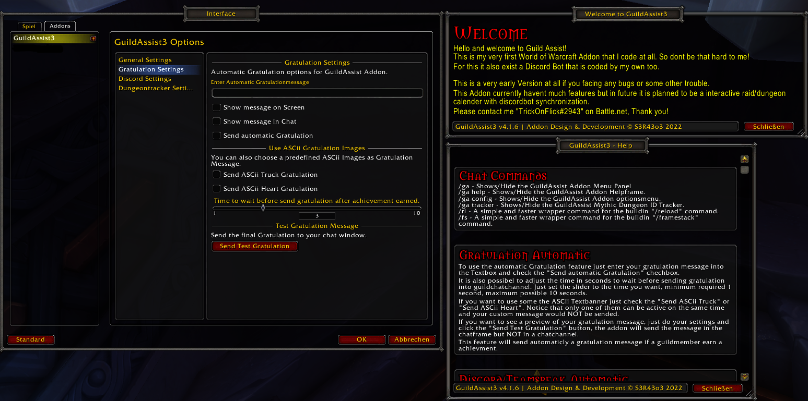

# GUILDASSIST WoW AddOn #

> A small AddOn to add some utilities to the guildchat.

## Features ##

> - _Chatbot_ with some "!\<command\>"-Chatcommands
> - _gratulationmessage automatic_ to send it if a guildmate get a achievement
>
>
> __THE BACKGROUND BUG IS ALREADY KNOWN AND I WORK ON A FIX__

## Installation ##

>First release.
>If you facing any problems please open a new Issue.
>Just unzip the ZIP-File into your World of Warcraft Addons directory.

## Changelog ##

> - __v2.4.7:__
>   - add ingame chatbot with "!hilfe" and "!discord" command
>
>   - hotfix multigz sending if more than one guildmate get the same achievment
>
>   - update graphical interface and adding a help panel
>
> - __v1.2.4:__
>
>   - Add savehandler for automatic Toggle, save send state between gamesessions
>
>   - update versiontext generation
>
>   - add icon image files (SVG, PNG)

### Screenshots ###

> 
>
> 
>
