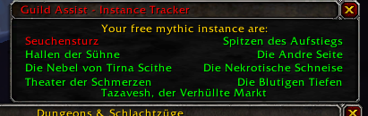

# GUILDASSIST WoW AddOn #

> A simple little addon to send automated guild chat messages when a guild member gets an achievement. You can choose between your own created message or predefined ASCII images.
> Also save Discord/Teamspeak invitation links and send them to the guild chat via chat command "!discord" if activated.
> The whole Project is now on Version 4.1.6 I refactor/redesign much like everything. As example the whole Addon can now be configured in the interface options from blizzad like all common Addons.
>
> - New graphical UserInterface
> - Translate to english
> - Add ACii Images as premade GZ-Message to choose

## Features ##

> - allows you to use the keyboard arrow keys to scroll through your sent message history.
> - Set the time in seconds between achieving the achievement and sending the congratulation message.
> - Shows your currently locked mythic +0 dungeons as a compact list above PVE window (if PVE window is open)
> - minimap icon to show/hide addon menu
> - Slashcommand "/fs" - short command for buildin "/framestack"
> - Slashcommand "/rl" - short command for buildin "/reload
> - Slashcommand "/ga" - Shows the AddOn Menu
> - Slashcommand "/ga help" - Shows/Hide the GuildAssist Addon Helpframe.
> - Slashcommand "/ga tracker" - Shows/Hide the GuildAssist Mythic Dungeon ID Tracker.
> - Slashcommand "/ga config" - Shows/Hide the GuildAssist Addon optionsmenu.

## Installation ##

>**This Addon is only tested on the latest world of warcraft retail version 9.2.7!**
>You can simple download and install this AddOn on [Curse Forge](https://www.curseforge.com/wow/addons/guildassist3)!
>If you facing any problems please open a new Issue.
>Just unzip the ZIP-File into your World of Warcraft Addons directory.

## Preview ##

## Changelog ##

v4.1.8 (Release Update)

> - fix not saving minimap position between gamesessions
> - fix not sending gratulation message
> - Add toggle to disable/enable show welcome message at start
> - add toggle to enable/disable dungeontracker
> - Add profile management to save settings for character/account
> - Create a calender plugin template frame
> - add Rightclick + Shift / LeftClick + Shift for enable/disable discord automatic / gratulation automatic to minimapbutton
> - create changlog window
> - update alignment from some text
> - Fix the "/ga tracker" chatcommand

v4.1.6 (Release Update)

> - Add "Ace3" to the project
> - Create New UI Design
> - Add Options for Addon to the Interface-Option tab from blizzard
> - Create Welcome Screen
> - Create Help Screen
> - Add new slashcommands
> - Refactoring Core, config
> - Add external String libary
> - Add new Minimap Button to open/hide options/help
> - Add new Previews

v3.4.4 (Hotfix Update)

> - add escape sequences to dicords links for "/"
> - remove not needed output on addon load
> - fix output bug with discord links that would not be sended
> - fix not colored mythic dungeon names on dungeon tracker frame at first start
> - add missing show window on start save variable
> - fix closing tracker window if menu window close
> - add soundeffects to changes and clicks
> - adjust minimap button size
> - update version

v3.4.2 (Release Update)

> - add instance id tracker for mythic +0 Dungeons
> - add gui frame for instance tracker
> - add basic mythic+ routes frame(not enabled yet)
> - create dungeon name list in ger and eng
> - create UpdateHandler for tracker

v3.3.5 (no Release):

> - add new Frame for mythic + Routes
> - add basic constructor for fontstrings & buttons
> - add scrollframe and scrollframe behaivour

v3.3.4:

> - add 'how to' to helpframe
> - change color from helpframe title
> - Update version
> - refactoring code
> - add config.lua
> - rename close-help button
